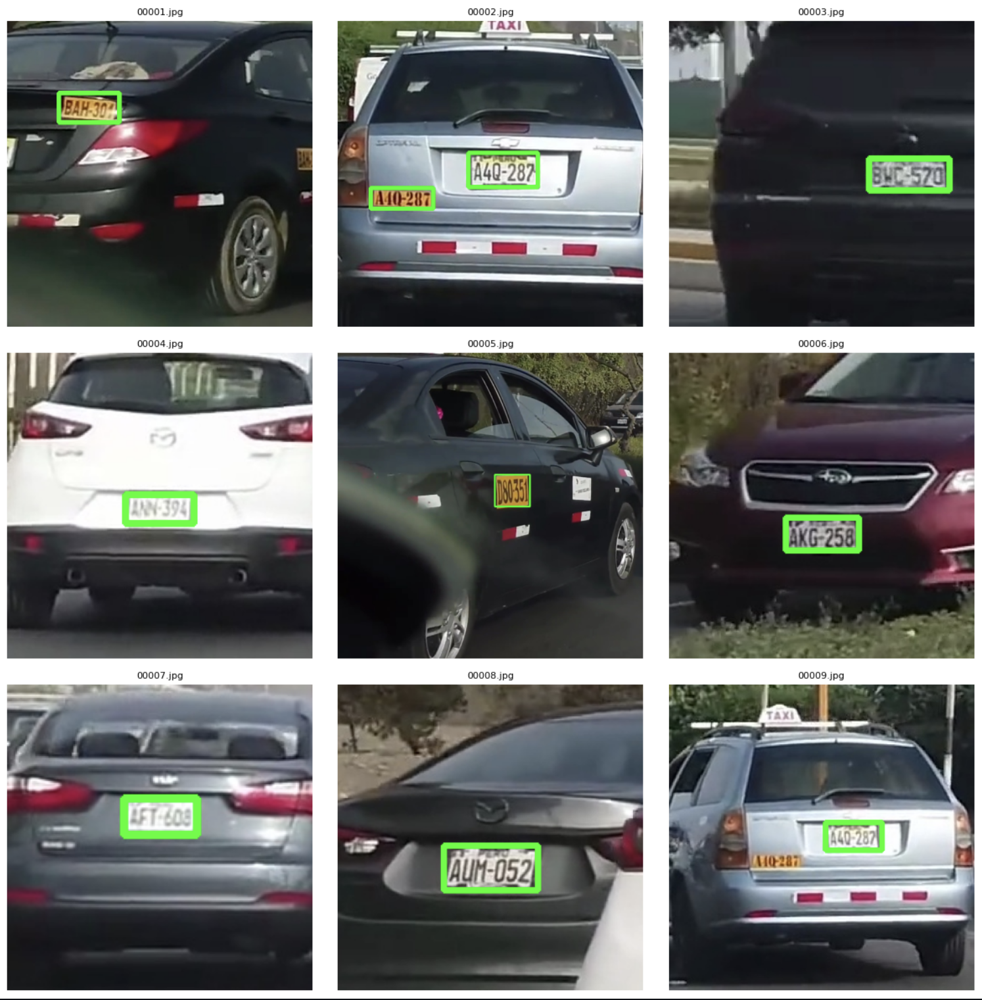

# ALPR for Peruvian License Plates 🇵🇪

This repository contains a working application for **Automatic License Plate Recognition (ALPR)** tailored to Peruvian road conditions. The pipeline detects vehicles, locates license plates within them, and extracts their alphanumeric content using OCR.

---

## 🎯 What This Project Does

- Detects vehicles in road video footage
- Locates license plates (painted or metallic) using a custom YOLOv7-based model
- Applies OCR to extract and validate plate numbers

  

